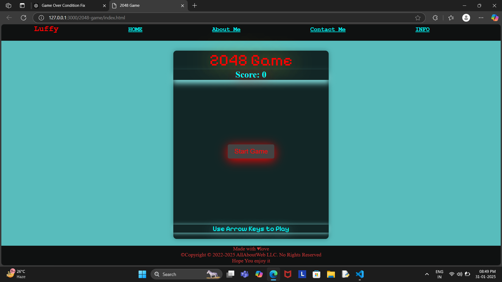

# 2048 Game

A **simple and interactive 2048 game** built with **HTML, CSS, and JavaScript**.  
Move tiles with arrow keys, **merge numbers**, and reach **2048** to win!

 

---

## 🎮 How to Play
- **Use Arrow Keys** (`←`, `→`, `↑`, `↓`) to move tiles.
- **Merge tiles** of the same number (e.g., `2 + 2 = 4`).
- **Keep merging** to reach `2048` and win!
- **Game Over** when no moves are left.

---

## 🚀 Features
✔ **Smooth tile movement & merging**  
✔ **Dynamic score updates**  
✔ **Game Over screen inside the grid**  
✔ **Customizable tile colors**  
✔ **Responsive design (works on all screens)**  
✔ **Restart game anytime**  

---

## 🔧 Installation & Usage
1. **Clone or Download** this repository:
   ```sh
   git clone https://github.com/yourusername/2048-game.git
